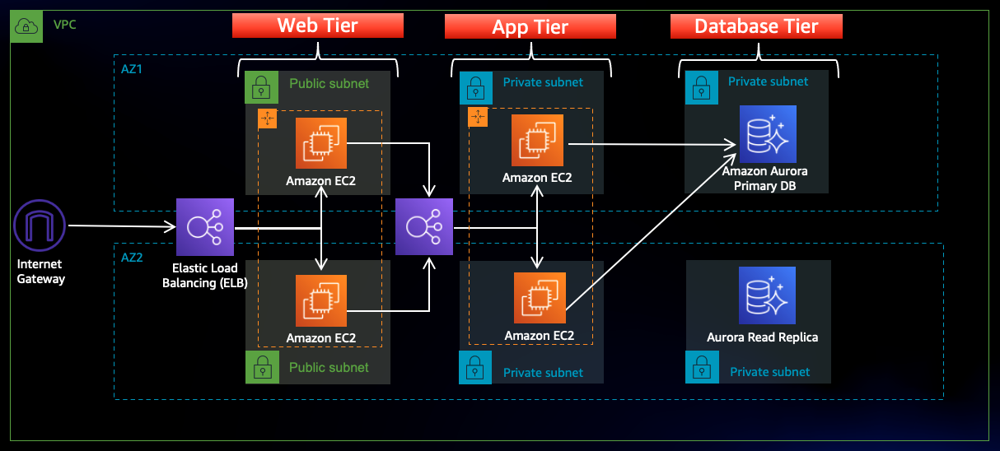
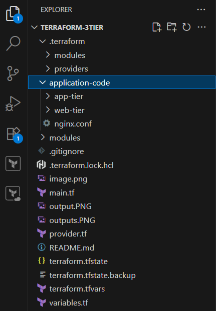
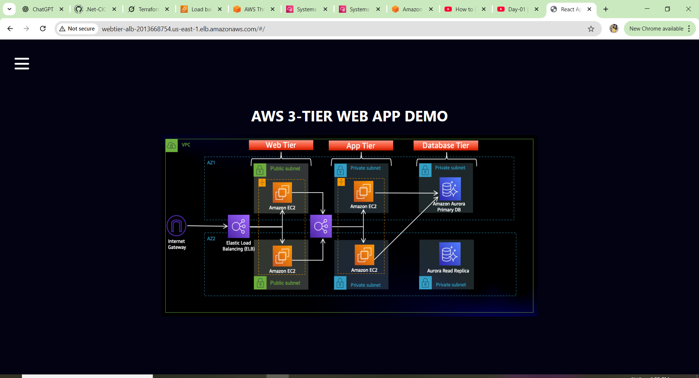
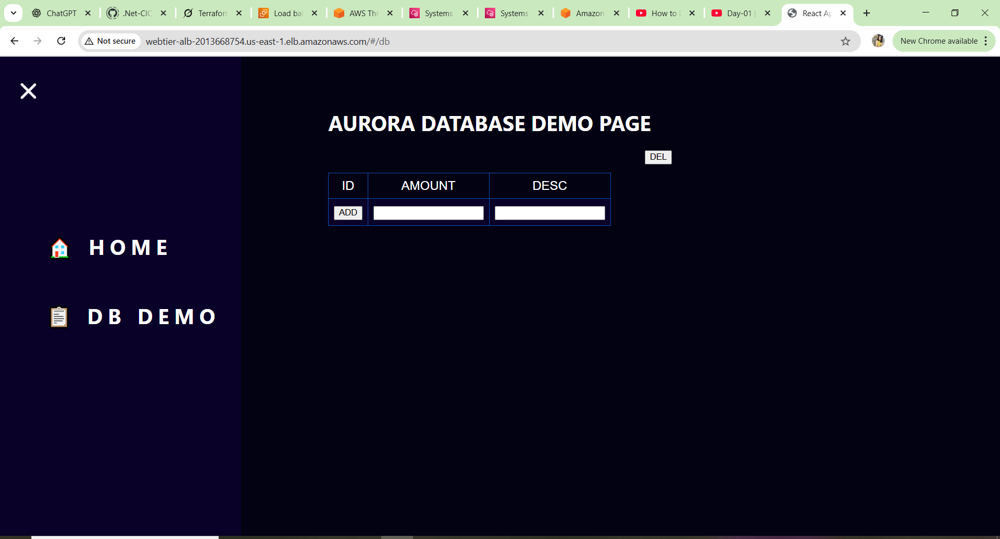

### **Introduction:**

# Architecture Overview :

In this architecture, a public-facing Application Load Balancer forwards client traffic to our web tier EC2 instances. The web tier is running Nginx webservers that are configured to serve a React.js website and redirects our API calls to the application tier’s internal facing load balancer. The internal facing load balancer then forwards that traffic to the application tier, which is written in Node.js. The application tier manipulates data in an Aurora MySQL multi-AZ database and returns it to our web tier. Load balancing, health checks and autoscaling groups are created at each layer to maintain the availability of this architecture.

Note :

For Instances Configuration please follow  
 
1. Apptier Instance Configuration.

   modules/apptier/README.md

2. Webtier Instance Configuration.

   modules/webtier/README.md

3. Project  web tier and app tier code :Download Code from Github

Note :

Download the code from this repository  into your local environment by running the command below. If you don't have git installed, you can just download the zip. Save it somewhere you can easily access.

git clone https://github.com/aws-samples/aws-three-tier-web-architecture-workshop.git

Like:
Terraform-3tier/application-code

### Output :

Terraform Commands :

Step1 : Install Terraform
Step2: Install AWS CLI
Step3: Configure AWS Credentials

1. terraform init
2. terraform validate
3. terraform plan
4. terraform apply
5. terraform destroy
6. terraform fmt
7. terraform refresh
8. terraform version

**Imp Note :**

**DB Credentials** according to me terraform.tfvars, please according to your wish.